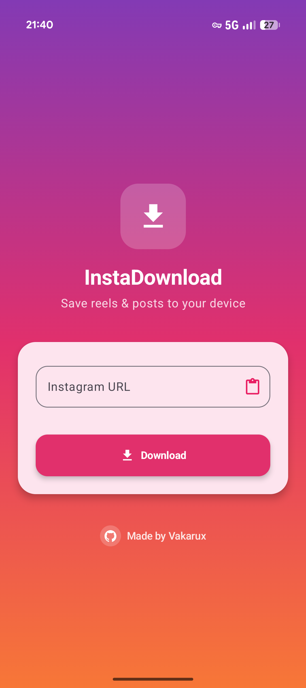
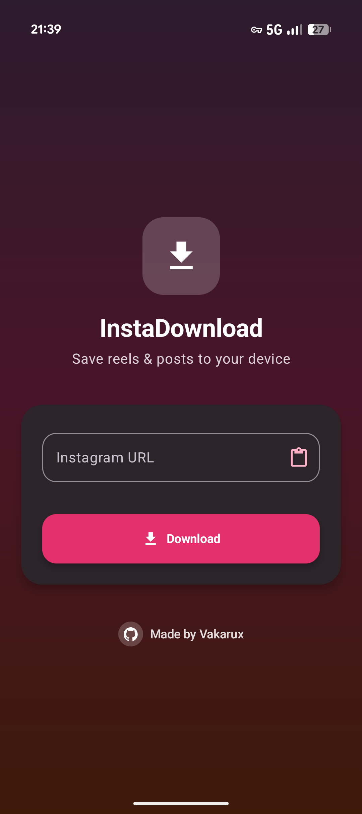

# InstaDownload for iOS

A SwiftUI remake of the Android app, built around Apple's Liquid Glass design language and distributed through AltStore.

The layout, copy, colors, and behavior are carried over from the Android build 1:1: same Instagram gradient, same hero tile, same card, same pink Download button. What changed is the material. The flat Material 3 surfaces are now Liquid Glass, and the platform-specific plumbing (photo library, Files, haptics) is native to iOS.

 

(Android screenshots, the iOS layout matches them.)

## Requirements

| | |
|---|---|
| Build | macOS with Xcode 26 (the iOS 26 SDK ships the Liquid Glass APIs) |
| Run | iOS 17.0+ (Liquid Glass renders on iOS 26+; older releases get a system-material fallback) |
| Distribute | AltStore (the app is sideloaded and re-signed with your own Apple ID) |

## Layout

```
InstaDownload.xcodeproj          Xcode 16+ synchronized-folder project, no file
                                 lists to maintain, new .swift files just get picked up
InstaDownload/
  InstaDownloadApp.swift         @main entry, theme + settings injection
  Core/
    InstagramDownloader.swift    Port of the Kotlin extractor (embed page, then a
                                 crawler fallback, then a public story probe)
    MediaSaver.swift             Photo library and security-scoped Files writing
    AppSettings.swift            @Observable prefs over UserDefaults
    Haptics.swift                Feedback generators
  UI/
    LiquidGlass.swift            The design layer: glass wrappers plus an
                                 iOS 17/18 fallback
    Theme.swift                  Brand palette, theme enum, gradient background
    DownloaderView.swift         Main screen
    SettingsView.swift           Settings sheet
  Assets.xcassets                App icon, accent color, GitHub mark
altstore/source.json             The AltStore source manifest
Scripts/build-ipa.sh             Unsigned .ipa build and packaging
```

## How Liquid Glass is applied

Apple's HIG is strict about where this material belongs, and those rules shaped the layout. `UI/LiquidGlass.swift` exists to keep the rest of the app honest about them.

**Glass is the functional layer, never the content layer.** The Instagram gradient is content, so it stays glass-free. Everything floating above it (the hero tile, the input card, the preview card, the error card, the toolbar button, the GitHub credit) is glass.

**Only the regular variant.** The HIG reserves `clear` for controls over photos and video, and calls for `regular` wherever a surface carries meaningful text. Every surface here does.

**No glass on glass.** This is the rule that decided the layout. The URL field and the pink Download button sit inside a glass card, so they're deliberately solid, which also happens to be exactly what the Android screenshots show. The "Update to latest release" button inside the error card uses `.bordered` for the same reason. The one real `.glass` button is the GitHub credit, which floats directly over the gradient with nothing beneath it.

**One `GlassEffectContainer` for the whole screen.** Every glass surface shares a container and a `@Namespace`, so the system blends and batch-renders them, and the preview card materializes out of the input card via `glassEffectID` instead of just fading in.

**Accessibility is the system's job.** `glassEffect` already adapts to Reduce Transparency and Increase Contrast, so the code doesn't second-guess it. Only the iOS 17/18 fallback path reads `accessibilityReduceTransparency`, where it swaps `.ultraThinMaterial` for an opaque fill.

Standard components (the toolbar button, the settings `Form`, the sheet) get Liquid Glass from the system for free and carry no custom styling at all.

## Differences from the Android build

| Android | iOS |
|---|---|
| MediaStore / SAF document tree | Photo library (default), or a Files folder via security-scoped bookmark |
| `ACTION_SEND` share target | `PasteButton`, reads the clipboard with no permission prompt |
| Custom `VibrationEffect` compositions | `UIImpactFeedbackGenerator` / `UINotificationFeedbackGenerator` |
| `WRITE_EXTERNAL_STORAGE` etc. | `NSPhotoLibraryAddUsageDescription` only |
| Material 3 `ElevatedCard` | Liquid Glass surfaces |

**Not included: a Share Extension.** Instagram > Share > InstaDownload would need a second target with its own bundle ID, and under a free Apple ID each App ID eats into the sideloading limit, a real cost for AltStore users. The paste flow covers the same job (Instagram's share sheet offers Copy Link). If you want the share sheet entry later, add an extension target and pass the URL through an App Group; nothing in the current code blocks it.

The story-download path is ported verbatim, including its limitation: Instagram only serves normal stories to logged-in accounts, so the public probe still usually comes back empty. The UI warns before you tap, same as Android.

## Building

Open `InstaDownload.xcodeproj`, select your team under Signing & Capabilities (the project ships with an empty `DEVELOPMENT_TEAM` on purpose), and run.

For an AltStore artifact:

```sh
./Scripts/build-ipa.sh                  # -> build/InstaDownload.ipa
./Scripts/build-ipa.sh --update-source  # also writes size/date into altstore/source.json
```

The `.ipa` is intentionally unsigned. AltStore re-signs it on install.

## Publishing to AltStore

1. `./Scripts/build-ipa.sh --update-source`
2. Attach `build/InstaDownload.ipa` to a GitHub release tagged `v<version>-ios`.
3. Check that `downloadURL` in `altstore/source.json` points at that asset.
4. Commit and push. The source is served straight from the repo:

   ```
   https://raw.githubusercontent.com/Orang-Studio/InstaDownload/main/InstaDownloadiOS/altstore/source.json
   ```

5. Users add that URL in AltStore under Sources > +.

`source.json` follows the current AltSource schema (`appPermissions` with `entitlements`/`privacy`, `versions[].buildVersion`, `size` in bytes). `size` starts at `0`; the build script fills it in, and AltStore will reject a mismatch.

Under a free Apple ID, sideloaded apps expire after 7 days and AltStore refreshes them in the background; a paid developer account extends that to a year.
